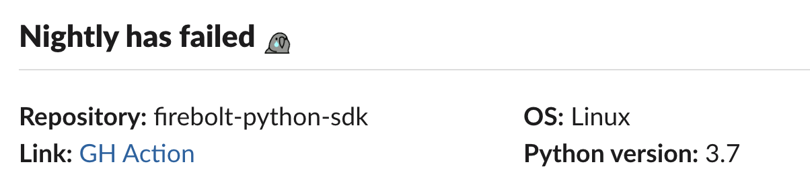

# action-slack-nightly-notify
Slack notify for Ecosystem projects

## How it looks in slack


## Inputs

- os
- programming-language
- language-version
- **Required:** notifications-channel
- **Required:** slack-api-key

## Example usage

```yml
- name: Slack Notify of failure
  if: failure()
  id: slack
  uses: firebolt-db/action-slack-nightly-notify@v1
  with:
    os: ${{ matrix.os }}
    programming-language: Python
    language-version: ${{ matrix.python-version }}
    notifications-channel: 'ecosystem-ci-notifications'
    slack-api-key: ${{ secrets.SLACK_BOT_TOKEN }}
```